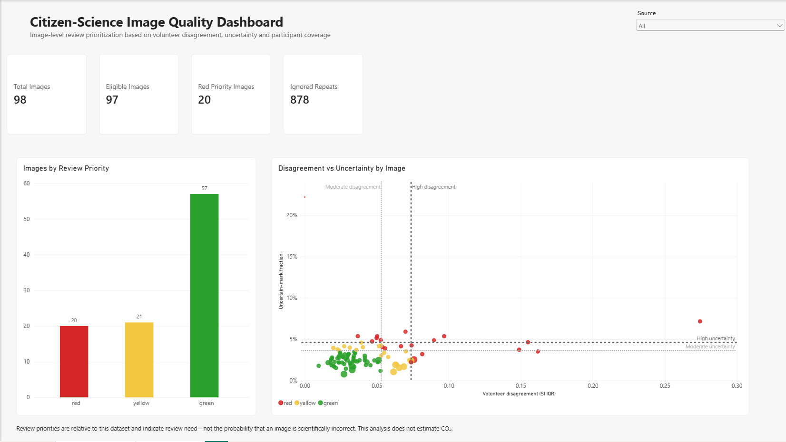
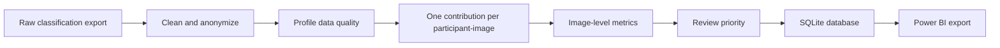
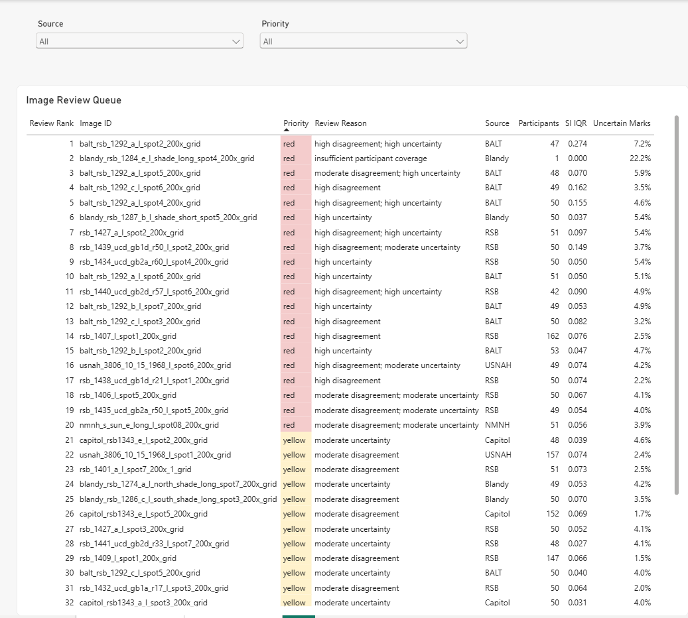

# Citizen-Science Image Quality Pipeline

An end-to-end Python, SQLite and Power BI project for transforming volunteer
image classifications into an image-level quality dashboard and review queue.

The pipeline processes classification data from the Zooniverse
[Fossil Atmospheres](https://www.zooniverse.org/projects/laurasoul/fossil-atmospheres)
project's **Easier Count** workflow. It measures volunteer disagreement,
uncertainty and participant coverage to prioritize images for further review.

*** Review priority is relative to this dataset. It is not the probability that an image is scientifically incorrect, and this project does not estimate atmospheric CO2.**



## Project results

| Metric | Result |
|---|---:|
| Raw classifications | 6,875 |
| Anonymized participants | 1,054 |
| Normalized images | 98 |
| Participant-image contributions retained | 5,996 |
| Additional repeat submissions ignored | 878 |
| Images eligible for analysis | 97 |
| Images with insufficient coverage | 1 |
| Green priority | 57 |
| Yellow priority | 21 |
| Red priority | 20 |

## For those who are not familiar with Zooniverse and citizen-science

Citizen science is the scientific research in which the general public (including people with non-scientific backgrounds) helps researchers in collecting information, tracking nature, or solving research problems. Examples include tasks such as counting the spots on a leaf, measuring rainfall, or sorting space photos. Those are then reviewed and used by professional researchers. This type of research relies on the "wisdom of the crowd" and would be impractical or even impossible without the help of the general public. Zooniverse is the world's largest platform for such kinds of research. 


## Why this project exists

Citizen-science datasets can contain repeated submissions, uneven coverage, ambiguous marks and disagreement between volunteers. A simple average can hidethese issues or allow prolific participants to have disproportionate influence.

This project builds a reproducible quality-control process that:

- parses and validates Zooniverse classification exports;
- anonymizes participants and excludes direct identifiers from outputs;
- normalizes image filenames;
- limits aggregation to one contribution per participant and image;
- quantifies disagreement, uncertainty and participant coverage;
- assigns relative green/yellow/red review priorities;
- stores validated outputs in SQLite; and
- exports an aggregated, dashboard-ready dataset for Power BI.

## Pipeline



| Step | Script | Purpose |
|---:|---|---|
| 1 | `01_prepare_classifications.py` | Parse annotations, normalize filenames and create anonymized participant identifiers |
| 2 | `02_profile_quality.py` | Profile coverage, repeat submissions, disagreement and uncertainty |
| 3 | `03_build_image_summary.py` | Retain the first valid contribution per participant-image and aggregate to image level |
| 4 | `04_assign_review_priority.py` | Calculate relative thresholds, priority levels, reasons and queue ranks |
| 5 | `05_build_database.py` | Build and verify SQLite tables, indexes and dashboard views |
| 6 | `06_export_dashboard.py` | Export one privacy-safe, image-level CSV for Power BI |

## Review-priority method

Two image-level quality signals are used:

- **Disagreement:** interquartile range of participant-level stomatal index.
- **Uncertainty:** fraction of submitted marks labelled `Not sure` or
  `Unclear patch`.

Thresholds are calculated from the 97 adequately covered images:

| Signal | Moderate threshold (75th percentile) | High threshold (90th percentile) |
|---|---:|---:|
| Disagreement | 0.053108 | 0.073825 |
| Uncertainty | 0.036138 | 0.046024 |

Priority rules:

- **Green:** neither signal reaches the moderate threshold.
- **Yellow:** exactly one signal reaches the moderate threshold.
- **Red:** insufficient participant coverage, either signal reaches the high
  threshold, or both signals reach the moderate threshold.

These are operational, dataset-relative rules intended to focus human review. Without expert reference classifications, they cannot measure classificationaccuracy or establish universal scientific cut-offs.

## Power BI report

The report contains two pages:

1. **Quality Overview** — KPI cards, source filtering, review-priority counts,
   and a disagreement-versus-uncertainty scatter plot with threshold lines.
2. **Review Queue** — an interactive, ranked table of the 41 red and yellow
   images with reasons and supporting quality metrics.



The report file is available at
`powerbi/Zooniverse_Data_Quality_Dashboard.pbix`.

## Repository structure

```text
.
├── data/
│   └── public/
│       └── image_quality_dashboard.csv
├── docs/
│   └── images/
│       ├── dashboard_overview.png
│       └── review_queue.png
├── powerbi/
│   └── Zooniverse_Data_Quality_Dashboard.pbix
├── src/
│   ├── 01_prepare_classifications.py
│   ├── 02_profile_quality.py
│   ├── 03_build_image_summary.py
│   ├── 04_assign_review_priority.py
│   ├── 05_build_database.py
│   └── 06_export_dashboard.py
├── .gitignore
├── LICENSE
├── README.md
└── requirements.txt
```

## Reproducing the pipeline

The raw classification export is intentionally not included. To run the full
pipeline, place an authorized Zooniverse classification export at:

```text
data/raw/classification_export.csv
```

Create an environment and install the dependencies:

```bash
python -m venv .venv
```

On Windows Command Prompt:

```bat
.venv\Scripts\activate.bat
pip install -r requirements.txt
```

Run the scripts from the repository root in numerical order:

```bat
python src\01_prepare_classifications.py
python src\02_profile_quality.py
python src\03_build_image_summary.py
python src\04_assign_review_priority.py
python src\05_build_database.py
python src\06_export_dashboard.py
```

The final public export is written to:

```text
data/public/image_quality_dashboard.csv
```

The pipeline was developed and tested with Python 3.14.

## Data privacy and publication scope

- Raw exports and participant-level tables are excluded from the repository.
- Direct Zooniverse identifiers such as usernames, user IDs and IP addresses
  are excluded from generated outputs.
- The committed CSV contains one aggregated row per normalized image and no
  participant-level records.
- The MIT license applies to the repository's original code only. Source data,
  publications and third-party materials remain subject to their original
  terms.

## Data provenance

The source classifications originate from the Zooniverse Fossil Atmospheres
project and its **Easier Count** workflow. Scientific context is provided by:

Soul, L. C., Barclay, R. S., Bolton, A. & Wing, S. L. (2018).
*Fossil Atmospheres: a case study of citizen science in question-driven
palaeontological research*. Philosophical Transactions of the Royal Society B,
374(1763), 20170388. https://doi.org/10.1098/rstb.2017.0388

This repository is an independent portfolio project and is not an official
Zooniverse or Smithsonian software product.

## Technologies

Python · pandas · NumPy · Matplotlib · SQLite · SQL · Power BI · DAX

## License

The original code in this repository is released under the MIT License. See
[`LICENSE`](LICENSE).
